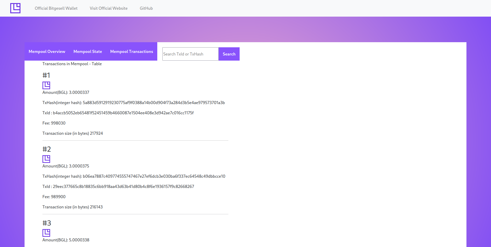

# Bitgesell Mempool Monitor

## Overview

This web application provides a real-time view of the Bitgesell mempool, allowing users to monitor pending transactions and their status. It is built using Create React App and utilizes Bitgesell's API to fetch mempool data.

## Features

- **Real-time Mempool Data:** View the latest information about pending transactions in the Bitgesell mempool.
- **Transaction Details:** Click on a transaction to see detailed information, including transaction hash, fee, inputs, outputs, and more.
- **User-Friendly Interface:** The application offers an intuitive and user-friendly design for easy navigation.

## Getting Started

### Prerequisites

Make sure you have [Node.js](https://nodejs.org/) and [npm](https://www.npmjs.com/) installed on your machine.

### Installation

1. Clone the repository:

   ```bash
   git clone https://github.com/naftalimurgor/bitgesell-mempool-monitor.git
   ```

2. Change to the project directory:

   ```bash
   cd bitgesell-mempool-monitor
   ```

3. Install dependencies:

   ```bash
   npm install
   ```

### Usage

1. Start the development server:

   ```bash
   npm start
   ```

   This will open the application in your default web browser and run a dev server at port 3000.

2. Explore the Bitgesell Mempool Monitor and enjoy real-time updates on the Bitgesell mempool.

## API

Please see full [API documentation](https://github.com/bitaps-com/bglapiserver/tree/master/api)

## Contributing

If you'd like to contribute to this project, please follow these steps:

1. Fork the repository.
2. Create a new branch for your feature or bug fix: `git checkout -b feature/new-feature`.
3. Make your changes and commit them: `git commit -m 'Add new feature'`.
4. Push your changes to your fork: `git push origin feature/new-feature`.
5. Create a pull request, explaining your changes and why they should be merged.

## License

This project is licensed under the MIT License - see the [LICENSE](LICENSE) file for details.

## Acknowledgments

- Thanks to the [Bitgesell](https://bitgesell.ca/) team for providing the API used in this application.
- This project was bootstrapped with [Create React App](https://create-react-app.dev/).

---

Feel free to customize this README according to your project's specific details and requirements.